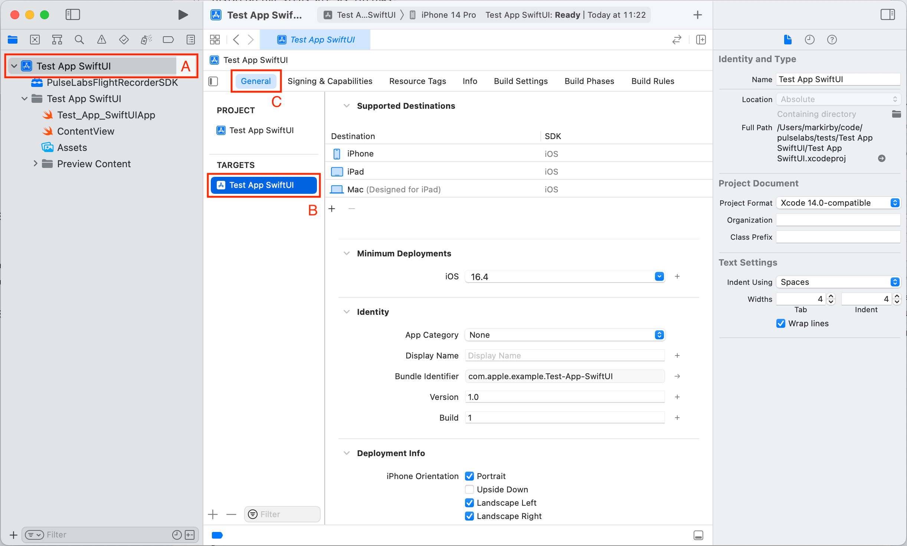
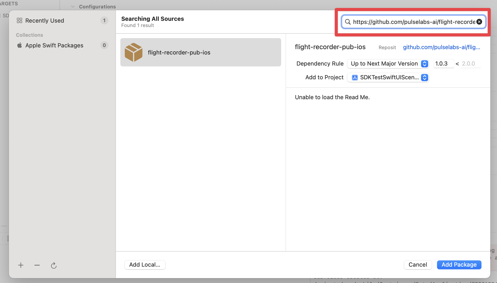

<p>
	
</p>
<p align="center">
  
</p>
<p align="center">
	<i>Delivering rich, cost-effective, in-context video of your users' experiences on your app. With just a shake, screenshot, or tap.</i>
</p>

---

## Install

1. Open the project you wish to install the framework into.
2. Select the project in the Project Navigator (A). Select your app's main target inside the **TARGETS** section (B), then click on the **General** tab (C) to open the general build settings for this target.

   

3. Verify that the version in **Minimum Deployments** is *15.0* or higher. If the version is lower than 15.0, update the minimum deployment to 15.0 or higher. If you wish to continue supporting users on devices running iOS lower than 15.0, refer to our [core documentation](https://pulselabs.gitbook.io/pulse-flightrecorder-docs/sdk-documentation/pulse-labs-flightrecorder-documentation/ios/install-the-sdk).

    NB: 14.x is now end of life, and users of these devices will no longer receive security updates from Apple. 

4. In the menu bar, select **File** -> **Add Package Dependencies...**.

5. In the **Apple Swift Packages** pop-up window, input *https://github.com/pulselabs-ai/flight-recorder-pub-ios.git* into the **Search or Enter Package URL** search box in the top right corner.

   

6. Select an appropriate **Dependency Rule**. We follow [Semantic Versioning 2.0.0](https://semver.org/), which means we will add bugfixes to the patch version (x.x.x), new features with no breaking changes to the minor version (x.x.x) and will always increase the major version (x.x.x) for breaking changes. We therefore recommend choosing **Up to Next Major Version**, to ensure you get all the patches and backwards compatible feature updates.
7. Select **Add Package** to install the package.
8. In the **Choose Package Products** for flight-recorder-pub-ios.git window, select **Add Package**.

The SDK is now installed. It appears in the **Package Dependencies** list in the Project Navigator. 

## Get Your API Key

Navigate to https://flightrecorder.pulselabs.ai/apps to create a new API key. 

## SDK Configuration

Full instructions for configuring the SDK for apps supporting SwiftUI, UIKit, Swift, and Objective-C can be found in our core documentation at https://pulselabs.gitbook.io/pulse-flightrecorder-docs/sdk-documentation/pulse-labs-flightrecorder-documentation/ios/sdk-configuration/swift-+-swiftui.

If your application is written in Swift and uses SwiftUI as the entry point to the UI, you can follow these steps: ​

1. Open the main entry point of your application, which is annotated with `@main` and contains your `App` instance. ​
2. Add the `import PulseLabsFlightRecorderSDK` statement to the top of the file:
   
   ```swift
    // Insert the import statement:
    import PulseLabsFlightRecorderSDK
    @main
    struct MyApp: App {    
   ```

3.  Observe the scenePhase value in the Environment, if you are not already doing so, using `@Environment(\.scenePhase) private var scenePhase` indicated in the example below at (A).

    Then, check when the phase is .active using `.onChange(of: scenePhase)` and `if phase == .active`, as shown in the below example at (B) and (C).

    Finally, insert the `FlightRecorderSDK.start(apiKey: "YOUR_API_KEY")` line of code so that it runs whenever the ScenePhase becomes `.active` as shown below at (D), replacing "YOUR_API_KEY" with your own API key.

    ```swift
    import PulseLabsFlightRecorderSDK

    @main
    struct MyApp: App {

        // A: Observe the scenePhase value in the Environment
        @Environment(\.scenePhase) private var scenePhase

        var body: some Scene {
            WindowGroup {
                MyRootView()
            }
            
            // B: add thhe .onChange
            .onChange(of: scenePhase) { phase in
                
                // C: Insert the check for phase .active
                if phase == .active {
    
                    // D: Insert the SDK start function call, replacing YOUR_API_KEY with your API key
                    FlightRecorderSDK.start(apiKey: "YOUR_API_KEY")

                }
            }
        }
    }
    ```

The SDK is now installed! The introduction screen will appear on the first run. You can then shake or take a screenshot to capture the video content and send a report.

Learn more in our [main documentation](https://pulselabs.gitbook.io/pulse-flightrecorder-docs/sdk-documentation/pulse-labs-flightrecorder-documentation/ios/create-custom-triggers).